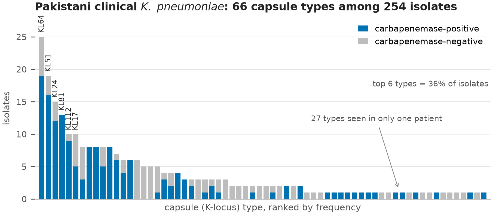
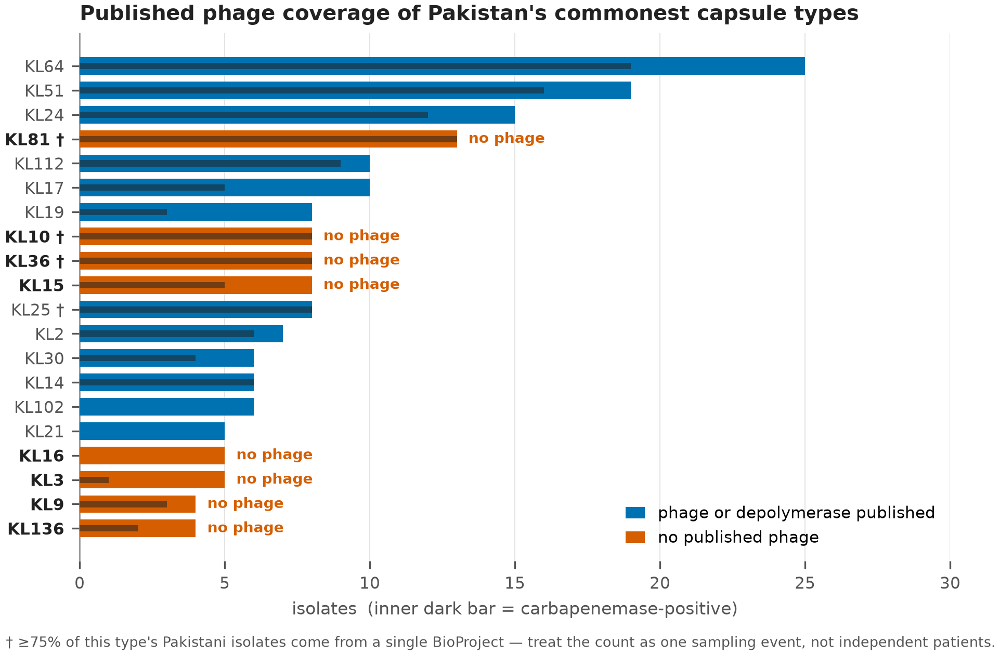
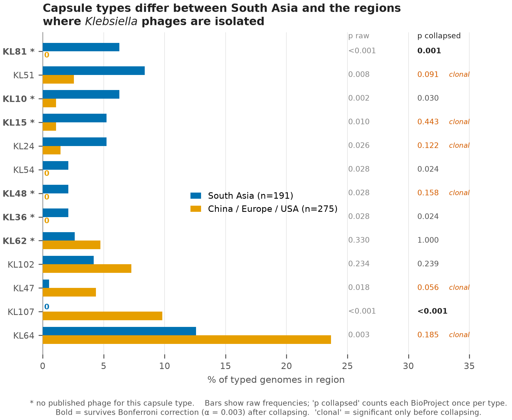

# Capsule types driving carbapenem-resistant *Klebsiella pneumoniae* in Pakistan are largely absent from the phage literature

## Authors

Talal Ahmed¹*, Ahmed Hussain Shah¹

¹ Department of Biological and Health Sciences, Pak-Austria Fachhochschule
Institute of Applied Sciences and Technology, Haripur, Khyber Pakhtunkhwa,
Pakistan

Talal Ahmed — ORCID [0009-0006-3132-304X](https://orcid.org/0009-0006-3132-304X)
Ahmed Hussain Shah — ORCID [0009-0004-1312-320X](https://orcid.org/0009-0004-1312-320X)

**Correspondence:** Talal Ahmed, B23S0131BMS004@fbse.paf-iast.edu.pk

**Keywords:** *Klebsiella pneumoniae*; capsule; K locus; bacteriophage;
depolymerase; phage therapy; carbapenem resistance; Pakistan; South Asia

---

## Abstract

Phage therapy is increasingly proposed for carbapenem-resistant *Klebsiella
pneumoniae*, but most *Klebsiella* phages bind a single capsule type, so a phage
is useful only where its capsule type circulates. We asked whether published
phages cover the capsule types found in Pakistani patients.

We typed 254 clinical *K. pneumoniae* genomes from Pakistan and curated the
phage and depolymerase literature into 34 phage–capsule records covering 27
phages and 15 capsule types. Nearly half the cohort was unmatched: 121 of 254 isolates
(47.6%), spanning 51 of 66 capsule types, belong to types for which no phage has
been described, and 67 of those isolates carry a carbapenemase. Collapsing each
BioProject to one isolate per type raises the unmatched fraction to 51.8%.

To ask why, we typed 475 genomes sampled on identical criteria from India,
Bangladesh and Nepal, China, Europe and the USA. Two capsule types separated
sharply. KL81 accounted for 6.3% of South Asian genomes and none of 275 from
China, Europe or the USA, and has no published phage; KL107 showed the reverse,
9.8% in those regions and absent from South Asia. Both survived collapsing
(*P* = 0.0014 and *P* = 0.0002). Four further differences did not, and are attributable
to clonal expansion within single studies.

Phages are isolated against locally available hosts, so the capsule types
entering the global phage collection track the regions doing the isolating. KL81
is a defined target for phage isolation in South Asia.

---

## Impact Statement

Phage therapy is one of the few remaining options for carbapenem-resistant
*Klebsiella pneumoniae*, and because most *Klebsiella* phages recognise a single
capsule type, a cocktail only helps where its capsule types circulate. This
study shows that almost half of Pakistani clinical isolates belong to capsule
types for which no phage has ever been described, and that the gap is not random:
the uncovered types are South Asian ones that are rare or absent in the countries
where *Klebsiella* phages are isolated. The global phage collection reflects the
capsule distribution of the regions doing the sampling. The practical
consequence is that imported cocktails are unlikely to fit South Asian patients,
and that KL81 — absent from 275 genomes from China, Europe and the USA, and
carbapenemase-positive in every Pakistani isolate examined — is a specific,
justified target for local phage isolation.

---

## Data Summary

All genome data analysed are publicly available assemblies from NCBI.

1. Pakistani cohort: 254 *Klebsiella pneumoniae* assemblies, accessions listed
   in Table S1.
2. Comparison cohort: 475 assemblies from India, Bangladesh, Nepal, China,
   Europe and the USA, accessions listed in Table S2.
3. Source metadata: NCBI Pathogen Detection release PDG000000012.2494,
   https://www.ncbi.nlm.nih.gov/pathogens/
4. Curated phage–capsule evidence table (34 records, 27 phages, 15 capsule
   types) with PMIDs and DOIs: Table S3.
5. Capsule typing performed with Kleborate v3.2.4 and Kaptive v3.2.2, both
   openly available (https://github.com/klebgenomics).
6. Analysis code: https://github.com/wwwtalalahmed98-collab/phagematch-pk,
   archived at Zenodo,
   doi:[10.5281/zenodo.22025259](https://doi.org/10.5281/zenodo.22025259)
   (concept DOI, resolving to the most recent version; the version analysed here
   is v1.0.0, doi:10.5281/zenodo.22025260).

No new sequence data were generated by this study.

---

## Introduction

Carbapenem resistance in *Klebsiella pneumoniae* has moved from a rarity to a
routine finding in South Asian hospitals, and the drugs held in reserve for it
are running out. Phage therapy is one of the few options that does not depend on
new chemistry. Individual patients have been treated successfully with tailored
preparations [1, 2], and interest in assembling defined cocktails against
carbapenem-resistant *K. pneumoniae* (CRKP) has grown accordingly.

The obstacle is specificity. *K. pneumoniae* is wrapped in a polysaccharide
capsule, and for most lytic *Klebsiella* phages that capsule is the receptor.
Phages carry tail-spike depolymerases that cleave one capsular polysaccharide
and not others, so host range usually tracks capsule type closely [3]. The
Kaptive v3.2.2 reference database used here contains 161 distinct *Klebsiella*
capsule (K) loci [4, 5]. A phage raised against a KL64 strain is generally
useless against a KL81 one.

That makes phage therapy a matching problem before it is a manufacturing
problem. A cocktail is only as good as the overlap between the capsule types it
covers and the capsule types infecting patients. Phage discovery is also
geographically concentrated: most characterised *Klebsiella* phages and
depolymerases come from China, Europe and the United States, and phages are
isolated by screening environmental samples against whatever host strains are at
hand. Whether the resulting collection matches the capsule types circulating in
South Asia has not, to our knowledge, been tested.

We asked three questions. Which capsule types occur in Pakistani clinical
*K. pneumoniae*? Which have a published phage or depolymerase? And where the
answer is none, is that because the type is globally rare, or because it is
common in South Asia and rare where phages are made?

---

## Methods

### Genome selection

Pakistani *K. pneumoniae* genomes were drawn from NCBI Pathogen Detection
(release PDG000000012.2494). Isolates were retained if labelled *Klebsiella
pneumoniae*, with `epi_type = clinical`, a collection date of 2015 or later, and
an assembly accession. This yielded 260 genomes; six returned a Kaptive
`Untypeable` capsule call and were excluded, leaving 254 for analysis.

The comparison cohort was assembled from the same metadata release under
identical criteria, sampling 100 genomes each from India, Bangladesh with Nepal,
China, nine western European countries, and the USA, using a fixed random seed
(20260815). Of 500 accessions, 475 remained retrievable and were typed; 466 gave
a typeable capsule call.

### Capsule typing

Genomes were typed with Kleborate v3.2.4 [6] using the `kpsc` preset, which
calls capsule (K) and O loci through Kaptive [4, 5]. Kaptive was pinned to
v3.2.2; v3.3.0 restructured the package and removed the `kaptive.database`
module that Kleborate's capsule module imports. Calls returned by Kaptive as
`Untypeable` were excluded throughout — six of 260 Pakistani and nine of 475
comparison genomes.

Typing ran in chunks of 20 genomes with per-chunk completion markers written to
persistent storage, allowing an interrupted run to resume from the last finished
chunk. Genomes were processed in shuffled rather than sorted accession order:
accession numbers cluster by submitting centre, so an interrupted sorted run
leaves a geographically skewed subset, whereas any prefix of a shuffled run
remains a balanced random sample across groups.

### Literature curation

PubMed was searched for `Klebsiella[tiab] AND depolymerase[tiab]` (129 records),
supplemented by targeted searches for every capsule type with three or more
isolates in the Pakistani cohort. Records were read and reduced to a table of
phage–capsule pairings graded by evidence:

- **depolymerase characterised** — enzyme expressed and shown to degrade that capsule
- **structure solved** — as above, with a solved structure
- **phage host confirmed** — phage lyses strains of the type, no enzyme characterised
- **genome announcement only**

Curation produced 34 records covering 27 phages and 15 capsule types, drawn from
the 27 primary reports cited as [8–34] and listed individually with evidence
grade in Table S3. Eleven types have a characterised depolymerase; four (KL17,
KL24, KL47, KL112) rest on host-range evidence alone.

### Statistics

Capsule frequencies were compared with two-sided Fisher exact tests, computed by
summing the hypergeometric tail. Sixteen capsule types were tested, so a
Bonferroni-corrected threshold of α = 0.05/16 = 0.003 is applied throughout.

Public genome collections are assembled largely from outbreak investigations, so
genomes sharing a BioProject may represent one transmission chain rather than
independent samples. Every comparison was run twice: on all genomes, and with
each BioProject collapsed to a single genome per capsule type (South Asia
n = 140, phage-source regions n = 212). Only results surviving the collapse are
reported as findings.

---

## Results

### Capsule diversity in Pakistani clinical *K. pneumoniae*

The 254 Pakistani isolates carry 66 distinct capsule types, a mean of 3.8
isolates per type, and 27 types appear in a single patient. The commonest type,
KL64, accounts for 9.8% of isolates and the six commonest together for 36%
(Fig. 1). No type dominates, which sets a floor on how few phages a useful
cocktail could contain.

### Published phage coverage

Joining the curated literature to the cohort leaves 121 of 254 isolates (47.6%),
across 51 of 66 capsule types, with no published phage of any kind. Sixty-seven
of those isolates carry a carbapenemase. The uncovered fraction is not a tail of
singletons: KL81 (13 isolates), KL10 (8), KL36 (8) and KL15 (8) account for 37
of them, and the first three are carbapenemase-positive in every isolate
(Fig. 2). Collapsing BioProjects moves the uncovered fraction to 51.8% (71 of
137), so the headline figure is conservative.

These per-type counts describe sampling events rather than independent patients.
All 13 Pakistani KL81 genomes come from a single BioProject, as do 6 of 8 KL10
and 6 of 8 KL36 genomes, and two projects supply 61% of the cohort. The data
therefore support no claim about how common any capsule type is within Pakistan.

### Capsule types differ between South Asia and the phage-producing regions

Two capsule types separate sharply between South Asia and the regions producing
most characterised *Klebsiella* phages, and both survive collapsing (Fig. 3,
Table 1).

**Table 1.** Capsule frequency by region, raw and BioProject-collapsed.

| K locus | South Asia | China/Europe/USA | *P* raw | *P* collapsed | Verdict | Published phage |
|---|--:|--:|--:|--:|---|---|
| KL81 | 6.3% (12) | 0.0% (0) | <0.0001 | **0.0014** | robust | none |
| KL107 | 0.0% | 9.8% (27) | <0.0001 | **0.0002** | robust | n/a — absent from the Pakistani cohort |
| KL10 | 6.3% | 1.1% | 0.0025 | 0.030 | weakened | none |
| KL36 | 2.1% (4) | 0.0% | 0.0277 | 0.024 | weakened | none |
| KL15 | 5.2% | 1.1% | 0.0096 | 0.443 | clonal | none |
| KL48 | 2.1% (4) | 0.0% | 0.0277 | 0.158 | clonal | none |
| KL51 | 8.4% | 2.5% | 0.0076 | 0.091 | clonal | characterised |
| KL64 | 12.6% | 23.6% | 0.0027 | 0.185 | clonal | characterised |

All twelve KL81 genomes were South Asian (Bangladesh/Nepal 7, India 5) and none
occurred in China, Europe or the USA. These twelve derive from seven distinct
BioProjects across two countries, so the pattern is not a single outbreak: it
survives collapsing (7 vs 0, *P* = 0.0014) and Bonferroni correction. KL107 is the
mirror image and equally robust, drawn from 17 distinct BioProjects.

The KL81 result held as the comparison set grew. An interim analysis at 435
genomes gave 10 vs 0; the additional 40 genomes added two further South Asian
KL81 isolates and none elsewhere.

Four differences — KL15, KL48, KL51 and the apparent depletion of KL64 in South
Asia — were significant on raw counts and lost significance on collapsing
(*P* = 0.443, 0.158, 0.091 and 0.185). They are attributable to clonal expansion
and are not reported as findings.

---

## Discussion

The defensible result is narrow: KL81 is a South Asian capsule type, it does not
appear in 275 genomes from China, Europe and the USA, and no phage or
depolymerase against it has been published. KL107 is its mirror image.
Everything else in the comparison weakened or collapsed once clonal structure
was accounted for.

That narrow result carries a general point. Phages are found by screening
sewage, hospital effluent or water against host strains the finding laboratory
already holds. The capsule types entering the world's phage collection are
therefore a sample of the capsule types available to the laboratories doing the
sampling. When those laboratories are concentrated in a few countries, the
collection inherits their local capsule distribution. KL81 was never in the
water being screened, and the absence of a KL81 phage follows from where the
screening happened rather than from any oversight.

For practice this reframes the problem. There is no shortage of *Klebsiella*
phages in general; several have characterised depolymerases with solved
structures. The problem is fit. A cocktail assembled from the published
collection is matched to a capsule distribution that is not South Asia's.
Phages for South Asian patients will mostly have to be isolated in South Asia,
against South Asian strains. Work of this kind has begun: a group in Haripur
published a lytic *Klebsiella* phage isolated from local sewage and active
against a K17 strain [7]. The same logic is being applied at hospital scale
elsewhere — a ventilator-associated pneumonia pilot built its cocktail from
retrospective genomic analysis of the unit's own isolates and reported
eradication in 6 of 7 patients receiving the matched cocktail against 0 of 7
receiving a deliberately mismatched one [1]. That contrast is the clinical form
of the argument made here.

KL81 is the most defensible single target this analysis identifies. It is South
Asian, uncovered, and carbapenemase-positive in every Pakistani genome examined
— though that last observation rests on one BioProject and requires replication.
A group with access to hospital sewage and a KL81 isolate could close this gap.

The clonality analysis deserves emphasis beyond this dataset. Four of six
nominally significant geographic differences disappeared when each BioProject
was counted once. Comparative work on public bacterial genomes is common, and
outbreak-derived genomes are the bulk of what is deposited, so a study that does
not test for this will report some clonal expansion as geography. The check
costs little.

What this study cannot do is estimate prevalence. Two BioProjects supply most of
the Pakistani cohort, and Pakistan has few deposited genomes relative to its
burden. Systematic sequencing from independent Pakistani centres would answer
the frequency question this dataset cannot. Extending the same analysis across
South Asia, where roughly 3000 genomes meet these criteria, would also have the
power to resolve the types that collapsed here.

### Limitations

Non-independence rather than sample size is the dominant limitation; only KL81
and KL107 survive Bonferroni correction after collapsing. With effective sizes
of 140 and 212, roughly four independent observations against zero are required
to reach *P* < 0.05, so types below about 3% frequency in South Asia cannot be
resolved; KL36 and KL48 gained no observations when the comparison set grew from
435 to 475 genomes, so more genomes sampled the same way will not resolve them.
"No published phage" means none found in PubMed under the searches described, so
the uncovered fraction is an upper bound; preprints, non-English literature and
unpublished collections were not searched. Both cohorts describe deposited
genomes rather than circulating populations. Serotype (K64) and genomic K locus
(KL64) were treated as equivalent when reconciling literature to genotypes,
which is conventional but not strictly exact. All predictions are computational;
no phage was tested against any isolate.

---

## Conclusion

About half of Pakistani clinical *K. pneumoniae* isolates belong to capsule
types with no published phage. At least one, KL81, is South Asian and absent
from the regions where *Klebsiella* phages are isolated. Closing that gap
requires isolating phages locally rather than importing cocktails matched to
another region's capsule distribution.

---

## Figure legends

**Fig. 1.** Rank-abundance of all 66 capsule (K) loci among 254 Pakistani
clinical *K. pneumoniae* isolates, each bar divided into carbapenemase-positive
and carbapenemase-negative isolates. The complete distribution is shown rather
than a top-N subset; 27 types occur in a single patient.

**Fig. 2.** The 20 commonest capsule types, coloured by whether any phage or
depolymerase has been published, with the inner dark bar showing
carbapenemase-positive isolates on the same scale. Daggered types draw ≥75% of
their Pakistani isolates from a single BioProject.

**Fig. 3.** Capsule frequency in South Asia (India, Bangladesh, Nepal; n = 191)
versus China, Europe and the USA (n = 275), ordered by difference. Types with no
published phage are starred. Two *P*-value columns are given: raw, and with each
BioProject collapsed to one genome per capsule type. Only KL81 and KL107 survive
collapsing under Bonferroni correction.

---

## Abbreviations

CRKP, carbapenem-resistant *Klebsiella pneumoniae*; K locus, capsule
biosynthesis locus; KpSC, *Klebsiella pneumoniae* species complex; MDR,
multidrug-resistant.

---

## Supplementary material

- **Table S1.** Pakistani cohort — 254 accessions with metadata and capsule calls.
- **Table S2.** Comparison cohort — 475 accessions with country group and capsule calls.
- **Table S3.** Curated phage–capsule evidence table — 34 records with evidence grade, PMID and DOI.
- **Table S4.** Full coverage-gap table — all 66 capsule types with burden, carbapenemase count and evidence grade.
- **Table S5.** Independence analysis — raw and BioProject-collapsed counts and *P*-values per capsule type.

---

## Required statements

**Funding information.** No specific funding was received for this work.

**Acknowledgements.** The authors thank the research groups whose public genome deposits and published phage characterisations made this analysis possible.

**Author contributions.** T.A., conceptualisation, methodology, data curation, formal analysis, software,
writing – original draft. A.H.S., data curation, validation, investigation,
writing – review and editing.

**Conflicts of interest.** The authors declare that there are no conflicts of
interest.

**Ethical statement.** No ethical approval was required. This study analysed
only publicly available genome assemblies and associated metadata; no human
participants, human material or animals were involved, and no new isolates were
collected.

**AI-assistance disclosure.** The authors used an AI assistant (Claude, Anthropic)
for analysis code development, literature search support, and drafting. All
analytical decisions, interpretation and final content are the authors' own, and
the authors accept full responsibility for the accuracy and integrity of the
work.

---

## References

Microbiology Society style: author names bold, first five authors then *et al.*,
journal abbreviation italic, volume bold, en-dashed page ranges. In-text
citations are square-bracketed numerals — [1], [1, 2], [1–4].

1. **Gorodnichev R, Shitikov E, Gurkova M, Kochetova T, Petrova M**, *et al.*
   Hospital-adapted inhaled phage therapy for ventilator-associated pneumonia
   caused by multidrug-resistant *Klebsiella pneumoniae*: a comparative pilot
   study. *Crit Care* 2026;**30**:64.
   doi:[10.1186/s13054-026-05839-8](https://doi.org/10.1186/s13054-026-05839-8)
2. **Yan H, Wu N, Zhou J, Jin A, Cheng M**, *et al.* Personalized aerosolized
   bacteriophage treatment of a pulmonary infection due to carbapenem-resistant
   *Acinetobacter baumannii* and *Klebsiella pneumoniae* in an infant. *Int J
   Infect Dis* 2025;**160**:108075.
   doi:[10.1016/j.ijid.2025.108075](https://doi.org/10.1016/j.ijid.2025.108075)
3. **Jiao X, Wang M, Liu Y, Yang S, Yu Q**, *et al.* Bacteriophage-derived
   depolymerase: a review on prospective antibacterial agents to combat
   *Klebsiella pneumoniae*. *Arch Virol* 2025;**170**:70.
   doi:[10.1007/s00705-025-06257-x](https://doi.org/10.1007/s00705-025-06257-x)
4. **Lam MMC, Wick RR, Judd LM, Holt KE, Wyres KL**. Kaptive 2.0: updated
   capsule and lipopolysaccharide locus typing for the *Klebsiella pneumoniae*
   species complex. *Microb Genom* 2022;**8**:000800.
   doi:[10.1099/mgen.0.000800](https://doi.org/10.1099/mgen.0.000800)
5. **Stanton TD, Hetland MAK, Löhr IH, Holt KE, Wyres KL**. Fast and accurate
   antigen typing with Kaptive 3. *Microb Genom* 2025;**11**:001428.
   doi:[10.1099/mgen.0.001428](https://doi.org/10.1099/mgen.0.001428)
6. **Lam MMC, Wick RR, Watts SC, Cerdeira LT, Wyres KL**, *et al.* A genomic
   surveillance framework and genotyping tool for *Klebsiella pneumoniae* and
   its related species complex. *Nat Commun* 2021;**12**:4188.
   doi:[10.1038/s41467-021-24448-3](https://doi.org/10.1038/s41467-021-24448-3)
7. **Hassan M, Alvi IA, Khan SN, Ahmed D, Asif M**, *et al.* Genomic and
   functional characterization of a lytic *Klebsiella* phage UHKP with
   antibiofilm activity. *Front Microbiol* 2026;**17**:1775638.
   doi:[10.3389/fmicb.2026.1775638](https://doi.org/10.3389/fmicb.2026.1775638)
8. **Li M, Li P, Chen L, Guo G, Xiao Y**, *et al.* Identification of a phage-derived depolymerase specific for KL64 capsule of Klebsiella pneumoniae and its anti-biofilm effect. *Virus Genes* 2021;**57**:434–442. doi:[10.1007/s11262-021-01847-8](https://doi.org/10.1007/s11262-021-01847-8)
9. **Li J, Sheng Y, Ma R, Xu M, Liu F**, *et al.* Identification of a depolymerase specific for K64-serotype Klebsiella pneumoniae: potential applications in capsular typing and treatment. *Antibiotics (Basel)* 2021;**10**:144. doi:[10.3390/antibiotics10020144](https://doi.org/10.3390/antibiotics10020144)
10. **Huang T, Zhang Z, Tao X, Shi X, Lin P**, *et al.* Structural and functional basis of bacteriophage K64-ORF41 depolymerase for capsular polysaccharide degradation of Klebsiella pneumoniae K64. *Int J Biol Macromol* 2024;**265**:130917. doi:[10.1016/j.ijbiomac.2024.130917](https://doi.org/10.1016/j.ijbiomac.2024.130917)
11. **Pan YJ, Lin TL, Chen CC, Tsai YT, Cheng YH**, *et al.* Klebsiella phage ΦK64-1 encodes multiple depolymerases for multiple host capsular types. *J Virol* 2017;**91**:e02457–16. doi:[10.1128/JVI.02457-16](https://doi.org/10.1128/JVI.02457-16)
12. **Eckstein S, Stender J, Mzoughi S, Vogele K, Kühn J**, *et al.* Isolation and characterization of lytic phage TUN1 specific for Klebsiella pneumoniae K64 clinical isolates from Tunisia. *BMC Microbiol* 2021;**21**:186. doi:[10.1186/s12866-021-02251-w](https://doi.org/10.1186/s12866-021-02251-w)
13. **Yang P, Shan B, Hu X, Xue L, Song G**, *et al.* Identification of a novel phage depolymerase against ST11 K64 carbapenem-resistant *Klebsiella pneumoniae* and its therapeutic potential. *J Bacteriol* 2025;**207**:e0038724. doi:[10.1128/jb.00387-24](https://doi.org/10.1128/jb.00387-24)
14. **Yan T, Ma C, Teng X, Yu K, Wang Q**, *et al.* Protective effects of recombinant depolymerase Dep44 against K64-CRKP-induced pulmonary infection in a murine infection model. *BMC Microbiol* 2026;**26**:177. doi:[10.1186/s12866-025-04691-0](https://doi.org/10.1186/s12866-025-04691-0)
15. **Pan YJ, Lin TL, Lin YT, Su PA, Chen CT**, *et al.* Identification of capsular types in carbapenem-resistant Klebsiella pneumoniae strains by *wzc* sequencing and implications for capsule depolymerase treatment. *Antimicrob Agents Chemother* 2014;**59**:1038–47. doi:[10.1128/AAC.03560-14](https://doi.org/10.1128/AAC.03560-14)
16. **Roch M, Sierra R, Panis G, Martins WB, Andrey D**. Synergistic activity of a KL51-depolymerase and a *Sugarlandvirus* bacteriophage against ST16 *Klebsiella pneumoniae*. *Microbiol Spectr* 2025;**13**:e0214225. doi:[10.1128/spectrum.02142-25](https://doi.org/10.1128/spectrum.02142-25)
17. **Blundell-Hunter G, Enright MC, Negus D, Dorman MJ, Beecham GE**, *et al.* Characterisation of bacteriophage-encoded depolymerases selective for key Klebsiella pneumoniae capsular exopolysaccharides. *Front Cell Infect Microbiol* 2021;**11**:686090. doi:[10.3389/fcimb.2021.686090](https://doi.org/10.3389/fcimb.2021.686090)
18. **Horváth M, Kovács T, Koderivalappil S, Ábrahám H, Rákhely G**, *et al.* Identification of a newly isolated lytic bacteriophage against K24 capsular type, carbapenem resistant Klebsiella pneumoniae isolates. *Sci Rep* 2020;**10**:5891. doi:[10.1038/s41598-020-62691-8](https://doi.org/10.1038/s41598-020-62691-8)
19. **Wintachai P, Santini J, Thonguppatham R, Stroyakovski M, Surachat K**, *et al.* Isolation, characterization, and anti-biofilm activity of a novel Kaypoctavirus against K24 capsular type, multidrug-resistant Klebsiella pneumoniae clinical isolates. *Antibiotics (Basel)* 2025;**14**:157. doi:[10.3390/antibiotics14020157](https://doi.org/10.3390/antibiotics14020157)
20. **Asif M, Alvi IA, Waqas M, Basit A, Raza FA**, *et al.* A K-17 serotype specific Klebsiella phage JKP2 with biofilm reduction potential. *Virus Res* 2023;**329**:199107. doi:[10.1016/j.virusres.2023.199107](https://doi.org/10.1016/j.virusres.2023.199107)
21. **Hassan M, Alvi IA, Khan SN, Ahmed D, Asif M**, *et al.* Genomic and functional characterization of a lytic Klebsiella phage UHKP with antibiofilm activity. *Front Microbiol* 2026;**17**:1775638. doi:[10.3389/fmicb.2026.1775638](https://doi.org/10.3389/fmicb.2026.1775638)
22. **Asif M, Alvi IA, Sibgha, Qadir ML, Shafiq-ur-Rehman**. Antimicrobial potential and genomic insights of novel Klebsiella phage SBP against K-112 serotype. *Curr Microbiol* 2026;**83**:279. doi:[10.1007/s00284-026-04867-5](https://doi.org/10.1007/s00284-026-04867-5)
23. **Chen X, Tang Q, Li X, Zheng X, Li P**, *et al.* Isolation, characterization, and genome analysis of bacteriophage P929 that could specifically lyase the KL19 capsular type of Klebsiella pneumoniae. *Virus Res* 2022;**314**:198750. doi:[10.1016/j.virusres.2022.198750](https://doi.org/10.1016/j.virusres.2022.198750)
24. **Hua Y, Wu Y, Guo M, Ma R, Li Q**, *et al.* Characterization and functional studies of a novel depolymerase against K19-type Klebsiella pneumoniae. *Front Microbiol* 2022;**13**:878800. doi:[10.3389/fmicb.2022.878800](https://doi.org/10.3389/fmicb.2022.878800)
25. **Yang L, Li J, Dai J, Liu J, Tan D**, *et al.* KP-C01: a novel phage with tail-associated depolymerase activity against KL102 carbapenem-resistant *Klebsiella pneumoniae*. *Phage (New Rochelle)* 2026;**7**:35–42. doi:[10.1177/26416549251406409](https://doi.org/10.1177/26416549251406409)
26. **Lorenz S, Abreu G, Oliveira H**. Genome sequences of *Klebsiella pneumoniae* bacteriophages SF_KL2 and SF_KL25. *Microbiol Resour Announc* 2025;**14**:e0121124. doi:[10.1128/mra.01211-24](https://doi.org/10.1128/mra.01211-24)
27. **Pertics BZ, Kovács T, Schneider G**. Characterization of a lytic bacteriophage and demonstration of its combined lytic effect with a K2 depolymerase on the hypervirulent Klebsiella pneumoniae strain 52145. *Microorganisms* 2023;**11**:669. doi:[10.3390/microorganisms11030669](https://doi.org/10.3390/microorganisms11030669)
28. **Lukianova AA, Shneider MM, Tokmakova AD, Landyshev NN, Kasimova AA**, *et al.* Novel Autographivirales phages Kiwi, Nika and Pie targeting Klebsiella pneumoniae K14: isolation, characterisation, genome analysis and study of the bacterial polysaccharide degradation. *Arch Virol* 2026;**171**:64. doi:[10.1007/s00705-025-06489-x](https://doi.org/10.1007/s00705-025-06489-x)
29. **Kang S, Han JE, Choi YS, Jeong IC, Bae JW**. Isolation and characterization of a novel lytic phage K14-2 infecting diverse species of the genus Klebsiella and Raoultella. *Front Microbiol* 2025;**15**:1491516. doi:[10.3389/fmicb.2024.1491516](https://doi.org/10.3389/fmicb.2024.1491516)
30. **Lu Y, Fang C, Xiang L, Yin M, Qian L**, *et al.* Characterization and therapeutic potential of three depolymerases against K54 capsular-type Klebsiella pneumoniae. *Microorganisms* 2025;**13**:1544. doi:[10.3390/microorganisms13071544](https://doi.org/10.3390/microorganisms13071544)
31. **Fang C, Dai X, Xiang L, Qiu Y, Yin M**, *et al.* Isolation and characterization of three novel lytic phages against K54 serotype carbapenem-resistant hypervirulent Klebsiella pneumoniae. *Front Cell Infect Microbiol* 2023;**13**:1265011. doi:[10.3389/fcimb.2023.1265011](https://doi.org/10.3389/fcimb.2023.1265011)
32. **Wang C, Wang Q, Mi Z, Zhao L, Bai C**. Genomic analysis of K47-type Klebsiella pneumoniae phage IME305, a newly isolated member of the genus Teetrevirus. *Arch Virol* 2023;**168**:280. doi:[10.1007/s00705-023-05900-9](https://doi.org/10.1007/s00705-023-05900-9)
33. **Fang Q, Zong Z**. Lytic phages against ST11 K47 carbapenem-resistant Klebsiella pneumoniae and the corresponding phage resistance mechanisms. *mSphere* 2022;**7**:e0008022. doi:[10.1128/msphere.00080-22](https://doi.org/10.1128/msphere.00080-22)
34. **Wang Z, Cai R, Wang G, Guo Z, Liu X**, *et al.* Combination therapy of phage vB_KpnM_P-KP2 and gentamicin combats acute pneumonia caused by K47 serotype Klebsiella pneumoniae. *Front Microbiol* 2021;**12**:674068. doi:[10.3389/fmicb.2021.674068](https://doi.org/10.3389/fmicb.2021.674068)
